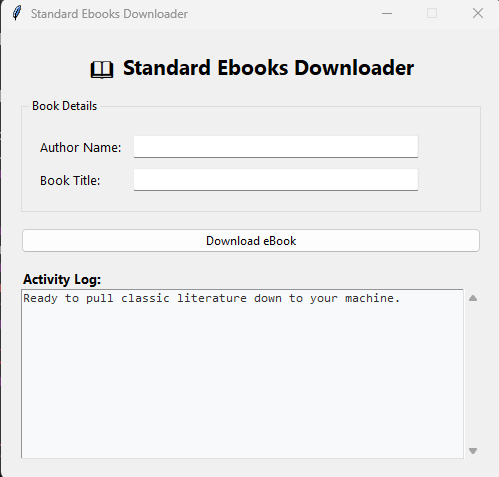
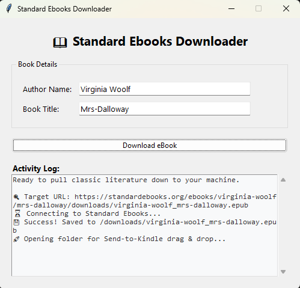

# Standard Ebooks Downloader (GUI Desktop App)

A lightweight Python desktop application that automatically generates official download URLs for books on [Standard Ebooks](https://standardebooks.org/), downloads the uncorrupted `.epub` file directly to a local subfolder, and automatically opens the directory for quick uploading to Kindle.

This workflow cuts out programmatic email configurations completely, bypassing the common Amazon `E999 Send to Kindle Internal Error` email server bugs by allowing clean manual ingestion via the browser.

---

## Application Interface




---

## Features

- **Graphical User Interface (GUI):** A clean desktop interface built with native Tkinter. No more editing code variables just to change a book name!
- **Asynchronous Threading Engine:** Downloads execute in a background thread so the window frame never locks up or goes into a "Not Responding" state.
- **Auto-Directory Control:** Automatically constructs and downloads objects into a local `/downloads` subfolder.
- **Workflow Hook:** Automatically launches Windows Explorer pointed directly at your downloaded file upon successful completion.

## System Dependencies

Make sure you have the Python `requests` library installed on your machine:

```bash
pip install requests